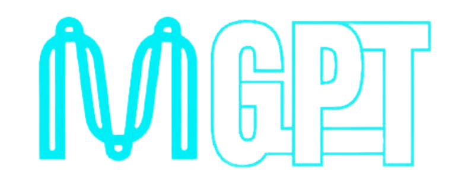

<div align="center">
  
</div>

# MinaGPT: Your All-in-One zkApp Assistant for Coding and One-Click Deployment

MinaGPT transforms the way you build zkApps on the Mina blockchain, making it effortless and exciting. **Powered by AI**, it helps you **write smart contracts faster, smarter, and with greater confidence**. No clunky setups, no endless documentation—just your browser, your Mina wallet, and your ideas brought to life.

Imagine writing smart contracts in minutes with the help of **AI-guided suggestions** and **deploying them with a single click**, all without leaving your browser. Whether you're a curious newcomer or a seasoned developer, MinaGPT clears the path for your creativity, letting you focus on building the future instead of battling complexity. The possibilities are limitless—code, deploy, and innovate like never before!


## Features

- 💡 Write Smart Contracts with Ease: An intuitive interface for simple zkApp development, with AI-assisted coding and error detection.
- 🚀 One-Click Deployment: Deploy contracts directly from the browser with one click, using Mina Wallet for secure signing.
- 🔗 Mina Wallet Integration: Easily connect and sign contracts with Mina Wallet, streamlining the deployment process.
- 🎯 Built for All Developers: Whether beginner or expert, MinaGPT adapts to your skill level, providing tailored assistance for smart contract development.

## Quick Start

Get started with MinaGPT in three simple steps:

- Prepared your Auro wallet
- Write zkApp code with AI assistance
- Deploy with one click

No setup required - start building in minutes!

## How to run

```
cd backend
pnpm install
pnpm run dev

cd ui
pnpm install
pnpm run dev
```

## Contact

- Twitter: [@wfnuser](https://x.com/wfnuser)
- Telegram: [@element14_revival](https://t.me/element14_revival)
- Wechat: wfnusee
